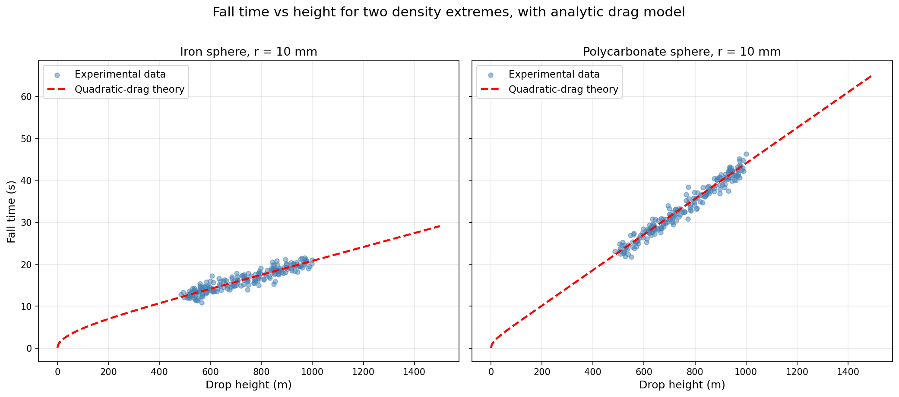

# Regression Methods Comparison on a Falling-Sphere Dataset

> Side-by-side comparison of five linear-regression techniques against an experimental dataset with known nonlinear physics, including a theoretical drag-model overlay.

## Overview

A practical comparison of ordinary least-squares, Ridge, Lasso, Huber, and stochastic gradient descent regression applied to an experimental dataset of spheres falling under quadratic drag. The data spans seven materials and several sphere radii, so the regressors have to handle both linear trends and nonlinear, material-dependent effects.

The interesting question isn't which model "wins" — it's where each one breaks down, and how that compares to the analytic drag solution the data is actually generated from.

## Key Features

- **Five regression methods benchmarked side by side** on a common train/test split
- **Robustness comparison** — Huber regression specifically tested against outlier sensitivity vs OLS / Ridge / Lasso
- **Theoretical physics overlay** — the analytic quadratic-drag fall-time is plotted on top of the data as the ground-truth reference
- **Per-material faceted scatter plots** via Seaborn `FacetGrid` to expose material-specific behaviour
- **Data cleaning pipeline** — type coercion, NaN handling, material-name validation, and bounds checks before any modelling

## Tech Stack

`Python` · `pandas` · `NumPy` · `scikit-learn` · `Seaborn` · `Matplotlib` · `tabulate`

## Approach

The raw CSV contains a mix of valid numeric data, malformed rows, and out-of-vocabulary material labels. The first stage is a careful cleaning pipeline: drop malformed rows on read, restrict to a known list of materials, coerce numeric columns and drop rows that fail conversion, then report on what was removed.

The five regressors are then fit on a common train/test split with identical input features. MSE on the held-out test set is the primary comparison metric. Linear, Ridge, and Lasso are expected to behave similarly here; Huber should be more robust to any outliers in the experimental data; SGD provides a baseline against the closed-form solvers.

The theoretical overlay function computes the expected fall time under quadratic drag analytically — `t(h) = sqrt(m / (k·g)) · arccosh(exp(h·k/m))` — using the sphere's measured radius and mass and a standard drag coefficient. Plotting this on top of the regression fits shows directly where the linear models track the physics and where they fail.

## Results

The script outputs:
- Per-material scatter plots of fall-time vs drop-height
- Test-set MSE for each of the five regression methods
- Coefficient tables formatted with `tabulate` for clean stdout output
- Theoretical drag-model overlay for visual comparison against fitted lines



## How to Run

```bash
git clone https://github.com/<your-username>/regression-methods-comparison.git
cd regression-methods-comparison
pip install -r requirements.txt
```

The dataset should be placed at `data/exercise3data.csv`. Then:

```bash
python regression_methods_comparison.py
```
